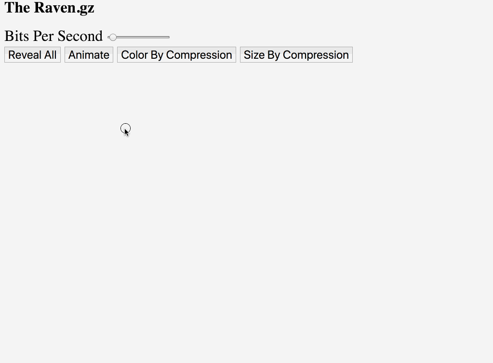
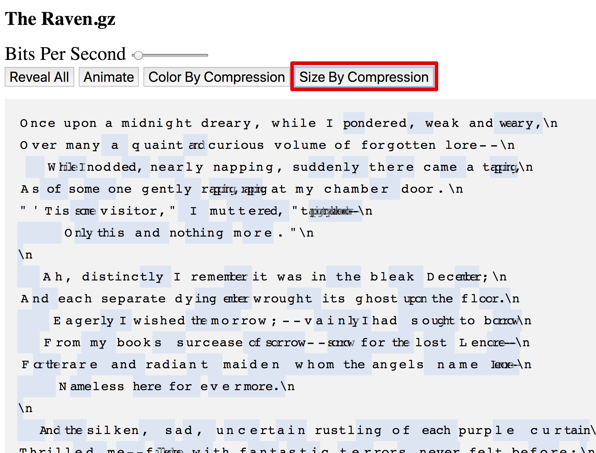
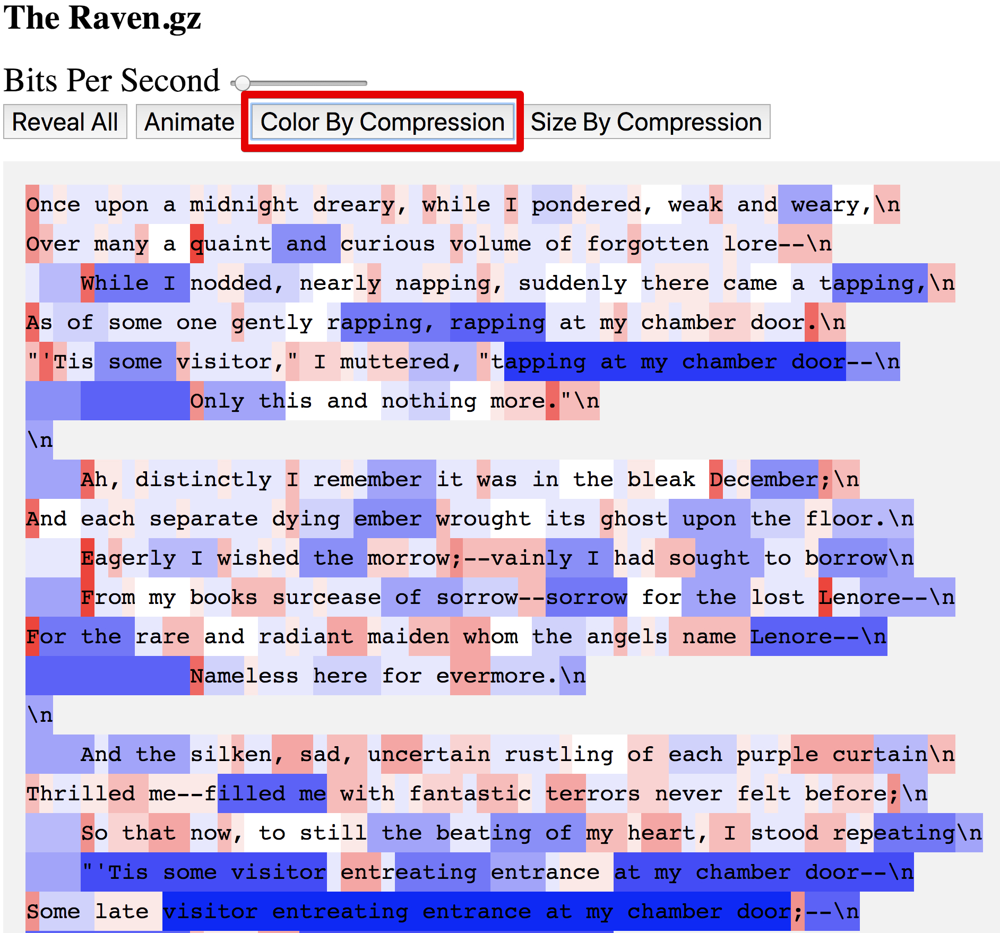

# The Raven.gz

A visualization of the gzip compression of the text in the poem "The Raven", by Edgar Allen Poe.

## Notes

Inspired by [this visualization by Julia Evans](https://jvns.ca/blog/2013/10/24/day-16-gzip-plus-poetry-equals-awesome/).

The source compression information is generated by this [gzip decoder](https://github.com/bantic/gziprust).
